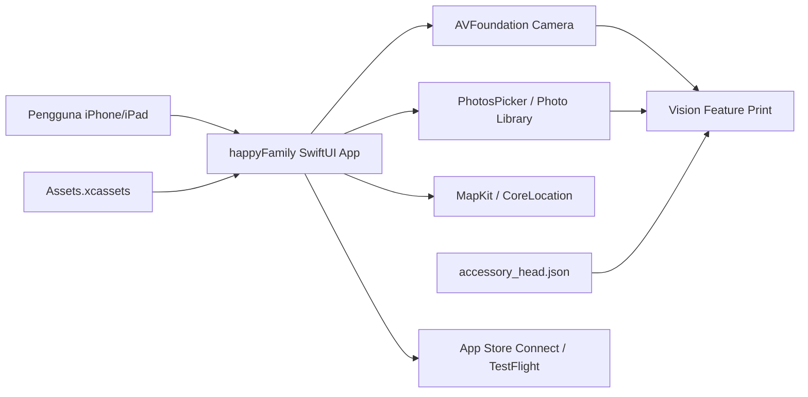
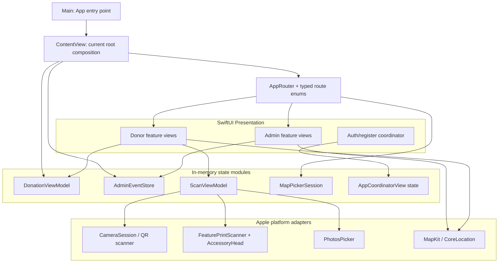
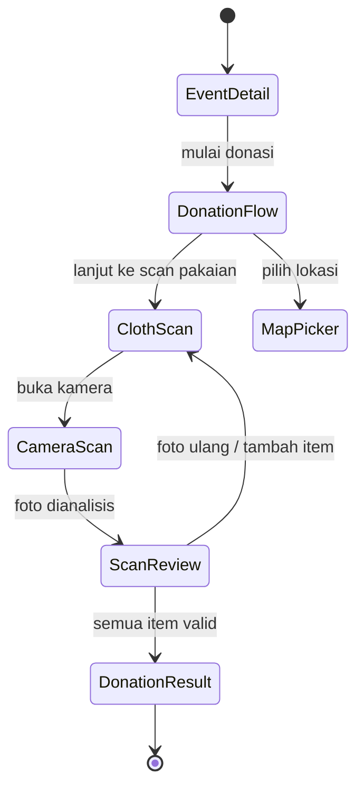
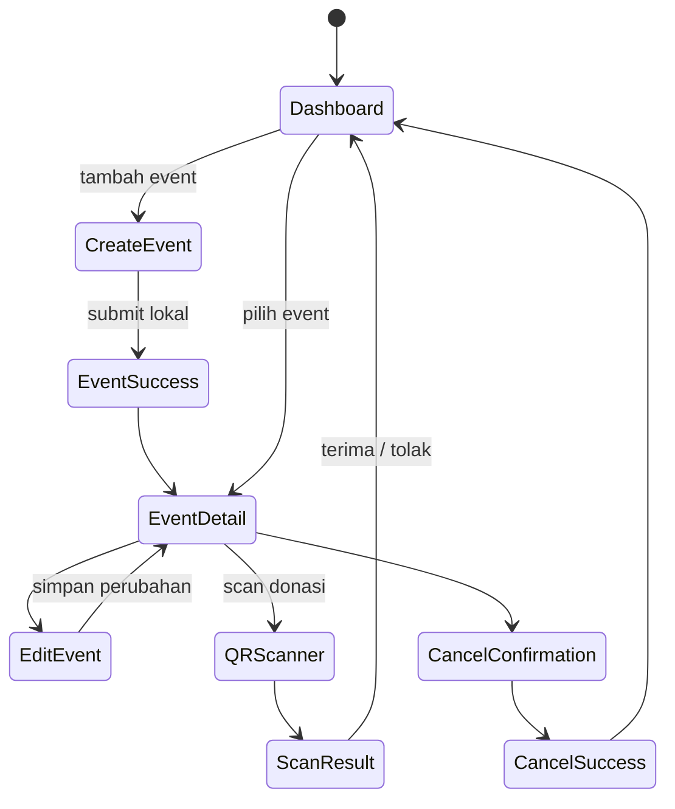
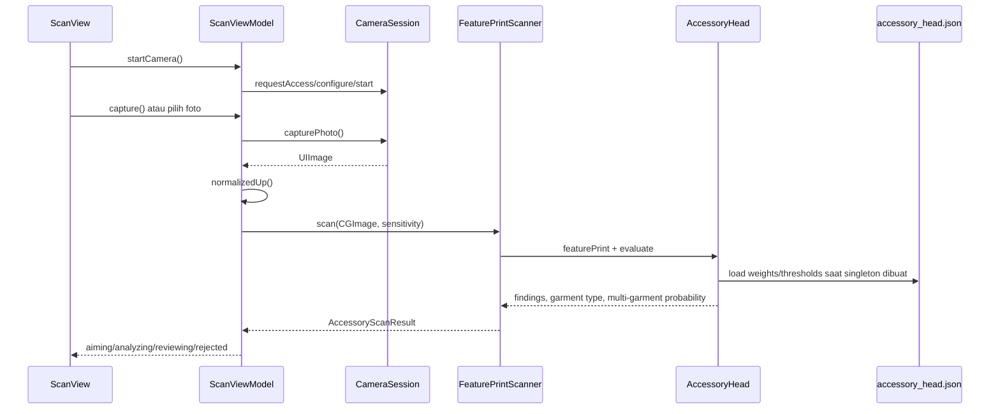

# Desain Sistem happyFamily

> **Status dokumen:** as-built pada 8 September 2026
> **Sumber:** `project.yml`, konfigurasi build, source Swift di `App/`, `Core/`, `DesignSystem/`, `Features/`, test target, dan pipeline Fastlane.
> **Catatan penting:** dokumen ini memisahkan arsitektur yang benar-benar sudah ada dari rancangan yang tersirat di README atau nama folder.

## 1. Ringkasan sistem

happyFamily adalah aplikasi iOS berbasis SwiftUI untuk dua persona:

1. **Pengelola/admin** — membuat dan mengelola event pengumpulan pakaian, melihat detail event, memindai QR donasi, menerima/menolak hasil scan, mengedit atau membatalkan event, dan melihat rekap/profil.
2. **Donor** — menemukan event, melihat detail lokasi/waktu, mengisi data donasi, memilih metode pengiriman, memotret atau memilih foto pakaian, menjalankan pemeriksaan pakaian berbasis Vision, lalu menerima booking ID dan QR code.

Secara teknis, implementasi saat ini adalah aplikasi client-side SwiftUI dengan:

- iOS deployment target 26.0 dan Swift 6;
- Xcode project yang dihasilkan dari `project.yml`;
- state bisnis utama yang hidup di memori proses;
- navigasi typed-route berbasis `NavigationStack`;
- kamera/QR scanner berbasis AVFoundation;
- klasifikasi pakaian berbasis Vision feature print + bobot JSON yang dibundel;
- MapKit untuk lokasi dan peta;
- Fastlane untuk lint, test, build, archive, TestFlight, dan App Store.

Belum ditemukan implementasi persistence, network client, backend adapter, session store, atau sinkronisasi cloud di source saat ini. Karena itu data event, profil, booking, dan hasil operasi akan hilang ketika proses aplikasi dihentikan, kecuali data tersebut berasal dari asset atau fixture lokal.

## 2. Konteks dan batas sistem



### 2.1 Di dalam scope

- UI dan state transisi login/register demo.
- Alur admin: dashboard, event creation, detail, edit, cancel, QR scan, donation result, recap, dan profil.
- Alur donor: home/detail event, donation form, clothing scan, drop method, result, dan map picker.
- Validasi lokal form dan aturan kelayakan scan.
- Pemrosesan foto lokal tanpa upload.
- Build configurations, signing target, asset bundling, dan Fastlane automation.

### 2.2 Di luar scope implementasi saat ini

- Autentikasi nyata dan session persistence.
- Database event, user, donation, booking, atau audit trail.
- API/backend dan authorization server.
- Sinkronisasi antar-device atau multi-user concurrency.
- Push notification.
- Upload image ke server/object storage.
- Pembayaran atau tracking ekspedisi.
- Analytics, crash reporting, dan observability production.

## 3. Arsitektur tingkat tinggi



### 3.1 Gaya arsitektur aktual

Arsitektur saat ini paling tepat disebut **feature-oriented SwiftUI dengan shared observable state**, bukan clean architecture penuh. Folder sudah dipisah berdasarkan feature, tetapi view masih memegang banyak state dan sebagian model domain tinggal di file view (`AdminEvent` berada di `DashboardView.swift`). Tidak ada layer repository/use-case/network yang nyata.

Dari sudut pandang desain module:

- `AppRouter` adalah module navigasi yang relatif dalam: caller hanya mengirim typed route, sementara destination mapping disentralisasi di extension `View`.
- `ScanViewModel` adalah module yang dalam: view mengoperasikan fase scan, sementara permission, camera lifecycle, normalization, Vision processing, dan error transition disembunyikan.
- `DonationViewModel` dan `AdminEventStore` masih tipis: mereka memegang state dan validasi dasar, tetapi belum memiliki persistence atau invariant transaksi.
- Sebagian besar file `*View` adalah presentation module yang dangkal karena menggabungkan layout, draft state, dan business transition dalam satu implementation.

## 4. Entry point dan root composition

### 4.1 `Main`

`App/Main.swift` membuat satu `AppRouter` sebagai `@State`, lalu menyuntikkannya melalui `.environment(router)` ke `ContentView`.

```text
Main
└── WindowGroup
    └── ContentView
        └── environment(AppRouter)
```

### 4.2 `ContentView` sebagai composition root aktual

`App/ContentView.swift` membuat:

- `DonationViewModel` sebagai state object Observation;
- `AdminEventStore` sebagai state object, tetapi saat ini environment injection untuk admin dikomentari;
- `NavigationStack` donor dengan `router.donersPath`;
- `SelectedEventDetailView` sebagai initial screen yang aktif.

Konsekuensinya, root runtime saat ini tidak memulai dari splash/login atau dashboard admin. `AppCoordinatorView` ada sebagai flow coordinator terpisah, tetapi tidak dipasang oleh `Main`/`ContentView`.

Admin `NavigationStack` dan `AdminEventStore` injection di `ContentView` masih dikomentari. Ini adalah gap integrasi, bukan sekadar detail dokumentasi.

## 5. Navigasi dan state machine

### 5.1 Typed routes

`Core/Navigation/Router.swift` mendefinisikan tiga route enum:

| Route | Destinasi | Status pemakaian |
|---|---|---|
| `AdminsRouter.dashboard` | `DashboardView` | tersedia, root admin masih dikomentari |
| `AdminsRouter.addEvent` | `EmptyView` | placeholder |
| `AdminsRouter.openScanner` | `QRScannerView` | tersedia |
| `DonersRouter.donationFlow` | `DonationFlowView` | tersedia |
| `DonersRouter.scan` | `ClothsView` | tersedia |
| `DonersRouter.openCamera` | `ScanView` | tersedia |
| `DonersRouter.result` | `ResultView` | tersedia |
| `DonersRouter.mapPicker` | `MapPickerRouteView` | tersedia |
| `MapPickerRouter.picker` | `MapPickerRouteView` | tersedia untuk map stack terpisah |

`AppRouter` memiliki tiga path:

```text
adminPath: [AdminsRouter]
donersPath: [DonersRouter]
mapPath: [MapPickerRouter]
```

`MapPickerSession` menjadi shared handoff object untuk menyimpan location name, address, coordinate, dan `revision`. `revision` dipakai sebagai signal perubahan ketika map picker selesai.

### 5.2 Alur donor



`DonationViewModel` adalah state bersama donor. Kontrak lokalnya:

- personal info valid bila `name`, `phone`, dan `agreedToTerms` terisi;
- capture valid bila `clothingItems` tidak kosong;
- review valid bila minimal satu clothing item `isPassed == true`;
- shipping valid bila `selectedShippingMethod != nil`;
- booking ID dibuat sekali saat view model dibuat;
- QR content dirakit dari booking ID, nama, dan nomor telepon.

Catatan desain: model booking belum menjadi aggregate yang durable. `bookingID` bersifat process-local dan belum dikirim ke sistem eksternal.

### 5.3 Alur admin



`AdminEventStore` saat ini hanya menyimpan `events` dan `selectedEventID`. Operasi mutasi yang terpusat baru `acceptDonation(weight:)`, yang menambah `collectedKg` pada event terpilih. Creation, edit, dan delete masih dipanggil langsung dari view melalui mutation array.

## 6. Domain dan module utama

### 6.1 Admin feature

Lokasi: `Features/Admins/`

| Area | Module utama | Tanggung jawab |
|---|---|---|
| Auth/register | `AppCoordinatorView`, `LoginWelcomeView`, `RegisterAccountView`, role/org views | state machine splash → login/register → role → organization → dashboard; saat ini lokal/demo |
| Dashboard | `DashboardView` + dashboard components | daftar event, active/upcoming/history, navigation dan action entry |
| Event creation | `CreatingView` + `CreatingEventComponents` | draft event multi-step: info, image, waktu, lokasi, jadwal, criteria, capacity |
| Event detail | `EventDetailView` + components | tampilkan event, map, progress, edit/delete/cancel entry |
| Event edit | `EditEventView` + components | edit draft event, editor sheet/full-screen, cancellation flow |
| QR donation | `QRScannerView`, `QRScannerViewModel`, `ScanResultView` | capture QR, menampilkan hasil, accept/reject |
| Recap | `RecapDonation` + chart/stat/row components | statistik dan riwayat donation presentation |
| Profile | `ProfileView` + profile components | profile, edit profile, donation/event history, logout overlay |

`AdminEvent` adalah value type dengan field event identity, date/time, location, criteria, capacity, collected weight, dan optional banner image data. Computed properties menyediakan progress, ongoing/upcoming status, dan formatted display strings.

### 6.2 Donor feature

Lokasi: `Features/Doners/`

| Area | Module utama | Tanggung jawab |
|---|---|---|
| Landing | `LandingView`, `LandingPalette`, `BrandMark` | entry presentation dan branding |
| Home | `HomeView` + components | event discovery, location disclosure, map/banner/progress |
| Donation | `DonationFlowView`, `DonationViewModel`, form/result/detail views | booking flow, clothing items, shipping method, QR result |
| Fashion scan | `ScanView`, `ScanViewModel`, camera/results components | capture/import image, ML evaluation, review state |
| Fashion core | `CameraSession`, `FeaturePrintScanner`, `AccessoryHead`, scan models | adapter platform camera + deterministic local inference |

### 6.3 Shared platform/design modules

- `Core/Navigation`: router, route enums, map-picker session.
- `DesignSystem/Colors/AppColor.swift`: named color assets yang dipakai lintas feature.
- `Resources/Assets.xcassets`: logo, color set, banner, empty state, icon, dan model JSON di `Features/Doners/FashionModel/Model`.

## 7. Fashion scan pipeline



### 7.1 Fase `ScanViewModel`

| Fase | Makna |
|---|---|
| `aiming` | camera/viewfinder aktif |
| `analyzing` | foto sedang diproses |
| `reviewing` | hasil valid, donor dapat meninjau |
| `rejected` | lebih dari satu garment terdeteksi |

`ScanViewModel` menjalankan analisis di detached task dengan prioritas user initiated. `CameraSession` menjaga lifecycle AVCaptureSession pada queue privat; ownership view model tetap `@MainActor`.

### 7.2 Kontrak model inference

- `FeaturePrintScanner` menggunakan Vision feature print revision 2.
- Image di-resize ke `canonicalLongestSide` sebelum feature extraction.
- `AccessoryHead` menormalisasi vector menggunakan mean/std dari JSON.
- accessory heads memakai threshold per sensitivity level;
- type head memakai softmax dan unknown threshold;
- count head menolak frame dengan probabilitas multi-garment di atas threshold;
- `AccessoryScanResult.removable` hanya memasukkan atribut yang ada di `removeFlagAttributes`.

Ketergantungan penting: dimensi embedding harus sama dengan bobot model. Ketidaksesuaian menyebabkan precondition failure. File model hilang atau format berubah menyebabkan `fatalError` ketika singleton `AccessoryHead.shared` dibuat.

## 8. Data ownership dan lifecycle

| Data | Pemilik saat ini | Lifecycle | Persisten? |
|---|---|---|---|
| navigation path | `AppRouter` | root app | tidak |
| map draft selection | `MapPickerSession` | selama flow map | tidak |
| donor draft | `DonationViewModel` | selama environment hidup | tidak |
| clothing scan | `ScanViewModel` | selama screen scan | tidak |
| admin events | `AdminEventStore` / local view mutation | selama process | tidak |
| admin profile | `AppCoordinatorView` | selama coordinator hidup | tidak |
| auth/session | belum ada module nyata | n/a | tidak |
| model weights | bundle resource | immutable app bundle | ya, sebagai asset |
| color/image assets | asset catalog | immutable app bundle | ya, sebagai asset |

Prinsip yang sebaiknya dipertahankan ketika backend ditambahkan: view tidak boleh menjadi source of truth untuk event dan booking. View cukup mengirim intent melalui interface module yang lebih dalam; adapter persistence/network menjadi implementation yang dapat diganti dengan fake untuk test.

## 9. Build, target, dan environment

`project.yml` adalah source of truth. `happyFamily.xcodeproj` generated dan tidak boleh diedit permanen langsung.

### 9.1 Target

| Target | Tujuan | Entitlement/signing |
|---|---|---|
| `happyFamily` | official app, Debug/Staging/Release | team-owned settings per config |
| `happyFamilyPersonal` | device development contributor | Personal Team, tanpa team-owned entitlements |
| `happyFamilyTests` | unit test bundle | bergantung pada app target |
| `happyFamilyUITests` | UI test bundle | bergantung pada app target |

### 9.2 Configurations

| Config | Bundle identifier | Use case |
|---|---|---|
| Local | local override | physical device contributor |
| Debug | `.debug` | development/simulator |
| Staging | `.staging` | internal QA/TestFlight |
| Release | production | App Store/TestFlight |

Local signing mengambil `HAPPYFAMILY_LOCAL_DEVELOPMENT_TEAM` dan `HAPPYFAMILY_LOCAL_BUNDLE_IDENTIFIER` dari ignored `Config/LocalOverrides.xcconfig`. Nilai credential/signing tidak boleh masuk repository.

## 10. Quality and delivery pipeline

Fastlane menyediakan:

- `lint`: SwiftFormat lint + SwiftLint;
- `format`: SwiftFormat + SwiftLint autocorrect;
- `test`: unit/UI test melalui scheme `happyFamily`;
- `build_debug`: simulator build tanpa signing;
- `build_staging` dan `build_release`: archive/IPA;
- `beta` dan `staging_beta`: upload TestFlight;
- `release`: upload App Store.

Setiap lane menjalankan `xcodegen generate` melalui `before_all`, sehingga perubahan `project.yml` direfleksikan ke generated project sebelum build.

Test yang terlihat saat ini masih minimal: UI test hanya memverifikasi `XCUIApplication().exists`. Tidak ada bukti test untuk validasi donation, router, event mutations, camera errors, model dimensions, atau QR workflow.

## 11. Observasi desain dan risiko

### P0 — root runtime belum menyatukan flow aplikasi

`ContentView` menampilkan `SelectedEventDetailView` secara langsung; auth coordinator tidak digunakan. Admin root dan `AdminEventStore` injection dikomentari. Hasilnya, jalur login/admin yang ada di source tidak otomatis menjadi jalur runtime utama.

### P0 — belum ada source of truth durable

Event, booking, profil, dan donation hanya berada di memori. Aplikasi belum dapat mendukung user nyata, restart recovery, multi-device, atau audit.

### P1 — domain model bercampur dengan view

`AdminEvent` didefinisikan di `DashboardView.swift`, sementara creation/edit/detail/profile menggunakannya. Ini menyebarkan coupling presentation ke seluruh admin feature. Model sebaiknya dipindahkan ke module domain tersendiri setelah interface persistence ditentukan.

### P1 — mutasi event belum memiliki seam tunggal

`AdminEventStore` baru memusatkan `acceptDonation`; create/edit/delete masih dilakukan dari view. Invariant seperti capacity, cancellation, selected event, dan consistency antar-screen berisiko berbeda-beda.

### P1 — authentication masih UI state

Callback login/Apple login langsung mengganti `currentScreen` ke dashboard tanpa verifikasi credential, session, error, atau logout yang benar-benar menghapus session.

### P1 — fixture/demo masih tampil sebagai data bisnis

`ProfileDonation.sampleData`, `ProfileHistoryDummyData`, default profile, dan dummy banner memberi fallback UI, tetapi harus dipisahkan secara eksplisit dari data production supaya tidak dianggap sebagai record nyata.

### P2 — error handling model belum graceful

Model JSON yang hilang atau tidak kompatibel memanggil `fatalError`. Untuk production, validasi resource perlu dilakukan saat startup/health check dan menghasilkan error state yang dapat ditampilkan atau telemetry yang aman.

### P2 — formatting dan waktu berada di model value

`AdminEvent` membuat `DateFormatter` pada computed property dan menggunakan `Calendar.current`/`Date()` langsung. Untuk hasil deterministik dan localization yang konsisten, formatting dan clock sebaiknya di-inject melalui module presentation/service.

## 12. Target desain evolusi

Evolusi yang disarankan tanpa melakukan big-bang rewrite:

```text
SwiftUI Views
    ↓ intents + bindings
Feature-facing deep modules
    ├── AuthSession
    ├── EventCatalog / EventEditor
    ├── DonationBooking
    ├── ScanPipeline
    └── MapSelection
    ↓ protocols at seams
Adapters
    ├── In-memory adapter untuk preview/test
    ├── Hosted backend adapter untuk production
    ├── Camera/Photos adapter
    └── Local ML adapter
```

Urutan prioritas:

1. Tetapkan root coordinator/session sebagai jalur runtime tunggal; pilih apakah `ContentView` atau `AppCoordinatorView` menjadi entry composition yang resmi.
2. Pindahkan `AdminEvent`, donation/booking model, dan profile model keluar dari file view.
3. Bentuk module deep untuk event mutation dengan interface kecil: load, create, update, cancel/delete, accept donation.
4. Tambahkan persistence/backend adapter di balik seam tersebut; pertahankan in-memory adapter untuk preview dan unit test.
5. Bentuk auth/session module yang memiliki state `signedOut`, `authenticating`, `signedIn`, `failed`, bukan callback screen-only.
6. Tambahkan test terhadap invariant domain dan reducer/state transition sebelum mengubah visual UI.
7. Pertahankan `ScanViewModel` sebagai facade scan, tetapi inject camera/scanner adapter agar error dan hasil inference dapat diuji tanpa perangkat.
8. Pisahkan fixtures dari default production fallback, dan beri nama `PreviewFixtures`/`TestFixtures`.

## 13. Kontrak test yang direkomendasikan

Minimal test suite berikut akan memberi leverage paling besar:

| Module | Test kontrak |
|---|---|
| `DonationViewModel`/booking | setiap validation gate, booking ID stable, QR content, shipping requirement |
| `AdminEvent` | progress clamp, zero capacity, ongoing/upcoming boundary, date/time display |
| event module | create/update/delete/cancel, selected ID, capacity invariant, accept donation |
| router | setiap route menghasilkan destination yang benar; map selection commit sekali |
| `AccessoryHead` | vector dimension, threshold behavior, dedup display groups, unknown garment |
| `ScanViewModel` | camera denied, capture failure, multi-garment rejection, retake, picked photo |
| auth/session | login success/failure, logout, role routing, restart behavior |
| UI | launch screen yang resmi, donor happy path, admin happy path, accessibility identifiers |

## 14. Kesimpulan

Fondasi UI dan device capability happyFamily sudah terbentuk dengan pemisahan feature yang cukup jelas. Module paling matang adalah pipeline fashion scan dan typed navigation. Namun sistem bisnis belum menjadi aplikasi multi-user karena belum ada session, persistence, backend, atau seam mutation yang konsisten.

Desain sistem yang paling aman adalah mempertahankan feature-oriented SwiftUI sebagai presentation layer, lalu menambahkan module domain yang lebih dalam di belakangnya. Dengan begitu, perubahan backend atau persistence tidak perlu menyebar ke puluhan view, sementara in-memory implementation tetap dapat dipakai untuk preview, demo, dan unit test.
